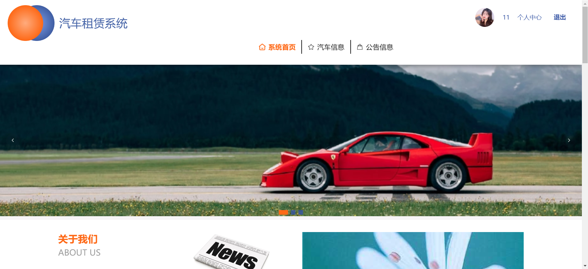
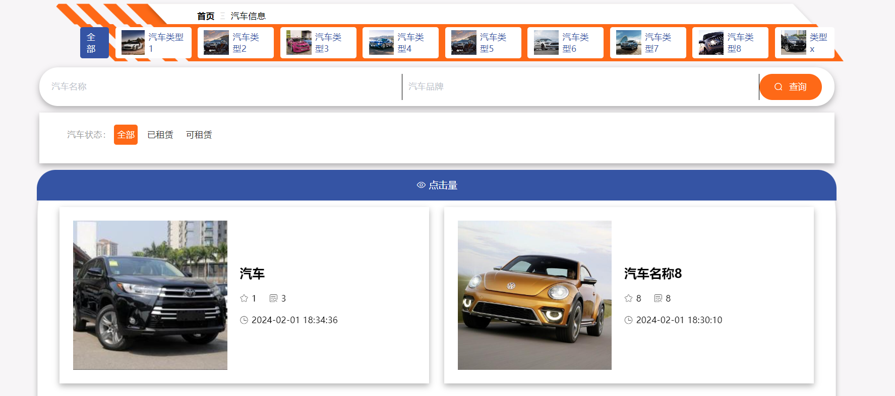
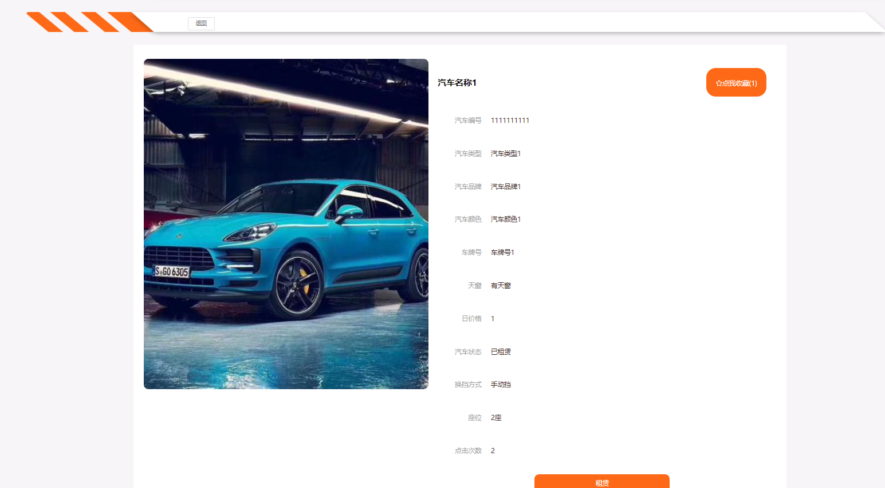
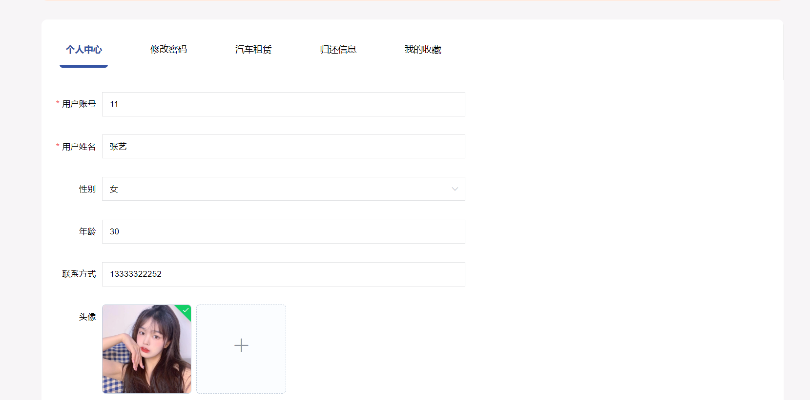
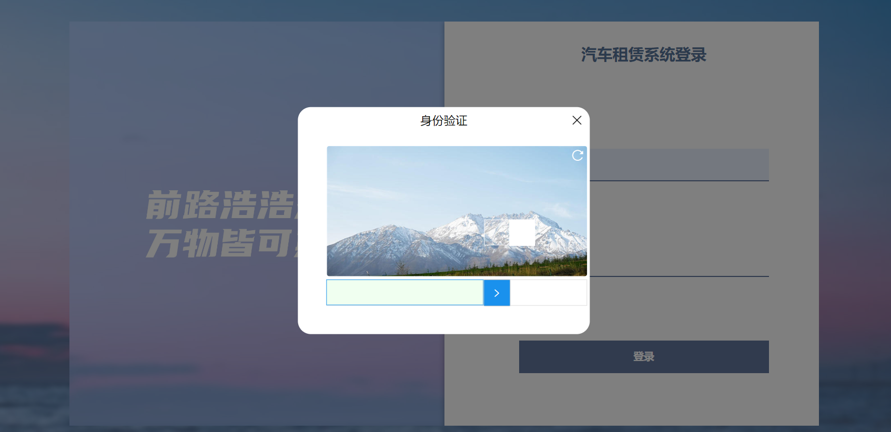
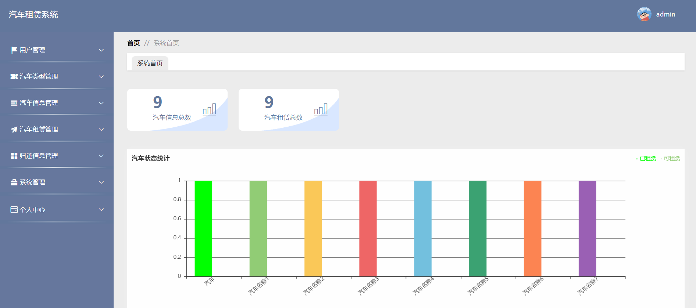
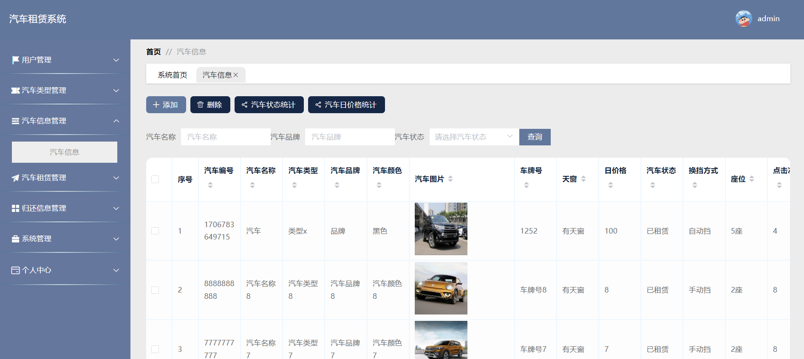
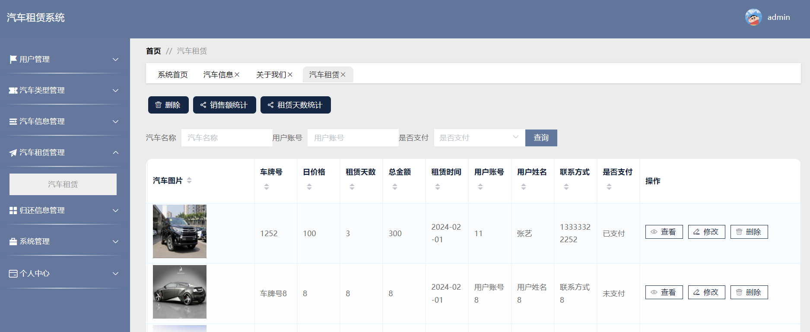
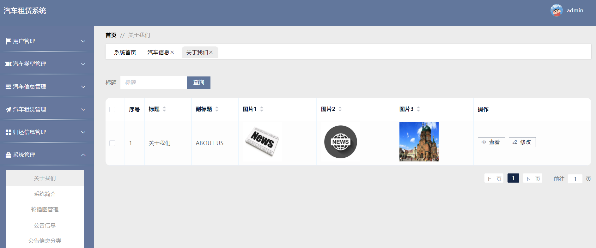

## 介绍
&emsp;&emsp;酒店管理系统，酒店预订系统，酒店客房管理系统，基于SpringBoot+Vue的酒店管理系统，具体功能如下图所示。

> 1. 后端技术：SpringBoot+MyBatis-Plus
> 2. 前端技术：Vue
> 3. 数据库：MySQL
> 4. 软件：IDEA/Ecilpse
> 5. **3119403249**

##  系统展示

&emsp;

#### 系统首页

> 导航栏、公告信息、汽车信息等。

#### 汽车列表

> 按类查询、按状态搜、搜索名称等。

#### 汽车详情

> 汽车的详细信息，租赁。

#### 个人中心

> 个人信息编辑、修改密码、汽车租赁、归还、收藏等。

#### 登录验证

> 滑块验证

****

#### 后台首页

> 左侧导航栏，上侧个人中心，主页可视化组件。

#### 汽车管理

> 管理员对汽车信息管理。

#### 租赁管理

> 租赁管理、可视化统计展示。

#### 系统管理

> 管理员管理系统信息。

